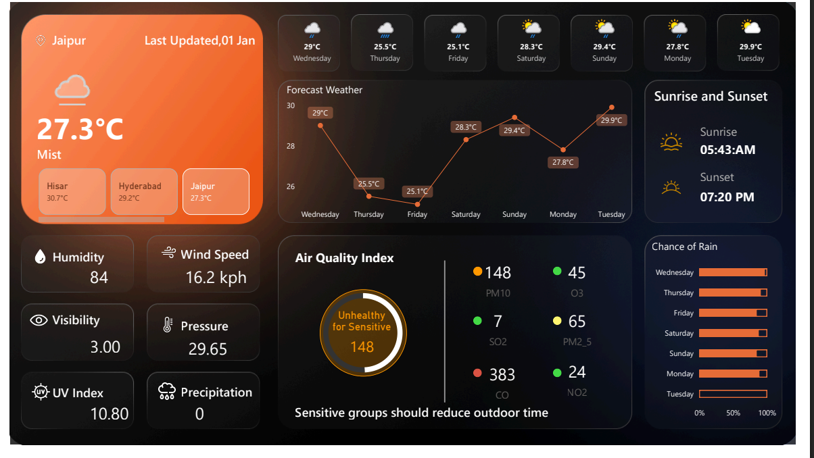

# 🌤️ Weather Forecast Dashboard – Power BI Project

Welcome to my first **Power BI Dashboard project**, created as part of my **Data Analyst Internship at KVON Tech**. This project visualizes real-time weather forecast data using a **Web API connection**.

---

## 📊 Project Highlights

- ✅ Built in **Power BI Desktop** (`.pbix` file included)
- 📡 **Real-time weather data** for Hisar, Hyderabad, and Jaipur etc.
- 📅 **7-day forecast** with temperatures, precipitation, and UV index
- 🌬️ Humidity, wind speed, pressure, and air quality index (AQI)
- 🌅 Sunrise and sunset timings
- 📈 Interactive charts and dynamic visuals

---

## 📁 Repository Contents

| File | Description |
|------|-------------|
| `Weather Forecast Dashboard.pbix` | Full Power BI dashboard source file |
| `Weather Forecast Dashboard.pdf`  | PDF preview/export of the dashboard |

---

## 🚀 Getting Started

1. Download or clone this repository.
2. Open the `.pbix` file using **Power BI Desktop**.
3. Refresh the data connection to retrieve the latest weather data via API.
4. Explore and customize the dashboard as needed.

---

## 🛠️ Skills Applied

- Power BI Report Design  
- API Data Integration  
- Data Visualization  
- Dashboard Development  
- Data Storytelling  

---

## 📷 Dashboard Preview

## 📩 Feedback

This is my **first Power BI project**. I’m open to suggestions and improvements.  
Feel free to fork, customize, and share your thoughts!

---

## 📌 About Me

I’m currently working as a **Data Analyst Intern** at **KVON Tech**, exploring real-world data solutions through business intelligence tools.

---

### ⭐ Give this repo a star if you find it useful!

